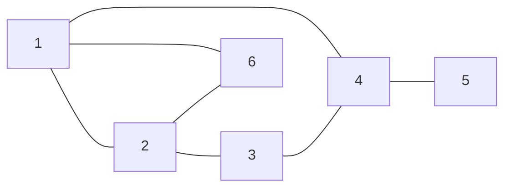

# City Storage Systems

Live coding challenge test

## FriendSuggester

Given a user id and a value k, return the top k friend suggestions for the user where a valid friend suggestion is a friend of a friend that isn't already your friend and "top" is defined by the number of mutual friends they have with you (e.g. if given the choice between a user who has 100 mutual friends with you versus one with only 2, the one with 100 mutual friends is likely the better friend suggestion)

### Example

Given the following graph of some friends:

Using the function `IFacebookClient.getFriends`:

Given Id 1, returns [2, 4, 6]

Given Id 2, returns [1, 3, 5]

Given Id 3, returns [2, 4]

Given Id 4, returns [1, 3, 5]

Given Id 5, returns [4]

Given Id 6, returns [1, 2]

When calling `FriendSuggester.getFriendSuggestions(1, 2)`, it should return `[3, 5]` because user 3 has 1 mutual friend with user 1 and user 5 has 1 mutual friend with user 1.